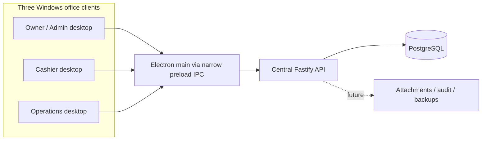

# Architecture and Milestone 1 contracts

Each desktop has its own main/preload/renderer processes. The diagram groups the boundary for readability. PostgreSQL is reachable by the API, not by any renderer or desktop client. The API owns transactions and authorization. There is no offline financial posting in this milestone.

## Workspace responsibilities

| Workspace | Responsibility |
| --- | --- |
| `packages/shared` | Zod response/configuration contracts, bridge types, canonical centavo transport |
| `apps/api` | Fastify startup, validated server environment, Pino, Drizzle schema/migration, real PostgreSQL readiness |
| `apps/desktop` | Electron lifecycle/security; main-process HTTP service; sandboxed typed preload; React connection view |

Shared output is built before dependents. Development watches shared output alongside API and renderer. API and shared compile with NodeNext; Electron/React use bundler resolution. All use strict TypeScript and unchecked-index checking.

## HTTP

`GET /health`: HTTP 200, `{ service: "bcis-api", status: "ok", timestamp: ISO-8601 UTC }`. Liveness only; does not claim database readiness.

`GET /health/ready`: HTTP 200 when database is reachable and `application_metadata` contains schema version 1. Otherwise HTTP 503. Payload `{ service: "bcis-api", status: "ready" | "degraded", database: "connected" | "unavailable" | "migration_required", timestamp }`. Neither endpoint discloses credentials, database names, SQL errors, or customer data. All responses disable caching.

The singleton schema table and positive-version check are the only domain-independent database structures. A generated migration creates it and inserts version 1. Future schema changes must update the version sentinel and shared compatibility constant deliberately. Migration runner is explicit; API startup never mutates the schema.

## IPC and desktop security

Renderer calls `window.bcis.getConnection()` with no arguments. Preload forwards exactly `bcis:connection:get`. Main validates originating webContents, exact renderer URL, and main frame. Main fetches only the configured HTTP(S) origin's `/health/ready`, disallows redirects, enforces a timeout, validates Zod and HTTP/payload agreement, and returns a typed result. Renderer validates the bridge response again.

Renderer has no Node integration, DB connection, arbitrary fetch, shell, filesystem or generic IPC bridge. Context isolation, sandbox, web security, permission rejection, popup/webview/navigation rejection are enabled. Production CSP blocks network connections; development allows only local Vite/HMR. No `DATABASE_URL` crosses the desktop build boundary. Future authenticated operations need specific methods plus server permissions.

## Current limitations and future invariants

- Public health endpoints are the only implemented API surface. No login, RBAC, posting, subscriber/financial schema, audit domain, report generation, seed dataset, backup/restore or installer is delivered yet.
- ExcelJS/pdfmake, Table and React Hook Form are dependencies for later milestones; they are not fake report/table/form implementations.
- Money is represented by canonical nonnegative integer centavo strings at the transport boundary, within PostgreSQL bigint range. Signed ledger movements, allocation arithmetic and payment rules require later domain design/tests.
- Ten database pool connections support concurrent clients structurally. Three parallel health reads verify the foundation, not the PDF's financial concurrency acceptance test.
- Local project cluster is loopback-only on 55432. Production uses a restricted API database role and separately managed migrations; the development cluster owner is not a production account.
- Production LAN transport should use HTTPS and host firewall rules. Client server-address override does not weaken sender validation or expose database credentials.

## Upstream references checked during setup

- [electron-vite guide](https://electron-vite.org/guide/), [environment variable boundaries](https://electron-vite.org/guide/env-and-mode), [sandboxed preload limitations](https://electron-vite.org/guide/troubleshooting)
- [Drizzle migrations](https://orm.drizzle.team/docs/migrations)
- [Tailwind Vite integration](https://tailwindcss.com/docs/installation/using-vite)

electron-vite 5 supports Vite 5/6/7. This project selects Vite 7 rather than incompatible Vite 8. The lockfile records exact tested versions.
