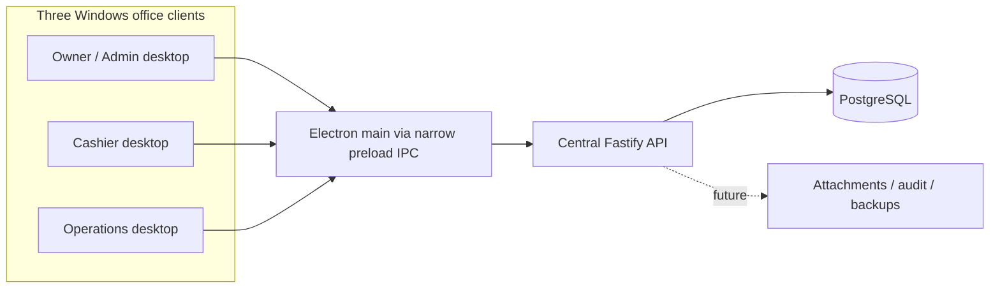

# Architecture and API security contracts

Each desktop has its own main/preload/renderer processes. The diagram groups the boundary for readability. PostgreSQL is reachable by the API, not by any renderer or desktop client. The API owns transactions, sessions, permissions, and audit records. There is no offline financial posting.

## Workspace responsibilities

| Workspace | Responsibility |
| --- | --- |
| `packages/shared` | Zod response/configuration contracts, bridge types, canonical centavo transport |
| `apps/api` | Fastify startup, validated server environment, Pino, Drizzle schema/migration, real PostgreSQL readiness |
| `apps/desktop` | Electron lifecycle/security; main-process authenticated HTTP service; sandboxed typed preload; React auth and subscriber views |

Shared output is built before dependents. Development watches shared output alongside API and renderer. API and shared compile with NodeNext; Electron/React use bundler resolution. All use strict TypeScript and unchecked-index checking.

## HTTP

`GET /health`: HTTP 200, `{ service: "bcis-api", status: "ok", timestamp: ISO-8601 UTC }`. Liveness only; does not claim database readiness.

`GET /health/ready`: HTTP 200 when database is reachable and `application_metadata` contains schema version 5. Otherwise HTTP 503. Payload `{ service: "bcis-api", status: "ready" | "degraded", database: "connected" | "unavailable" | "migration_required", timestamp }`. Neither endpoint discloses credentials, database names, SQL errors, or customer data. All responses disable caching.

`POST /auth/login` exchanges a validated username/password for an opaque bearer token. `GET /auth/me`, `POST /auth/change-password`, and `POST /auth/logout` require that token. `GET /admin/users` additionally requires `user.manage`. Permission hooks execute in Fastify before the handler and record denied attempts.

`GET /subscribers` provides bounded server-side filtering, sorting, and pagination. `GET /subscribers/:id` returns the complete subscriber profile. `POST /subscribers` validates and creates identity, contacts, addresses, service accounts, initial service events, and audit evidence in one transaction. `GET /reference-data` returns active service plans, areas, and collectors. Catalog creation endpoints require their respective server permissions.

`POST /billing/cycles/generate` serializes one calendar month with a PostgreSQL advisory transaction lock, snapshots each active service account's exact current centavo rate, posts the invoice and ledger debit, audits the run, and finalizes the cycle in one transaction. `GET /billing/cycles/:id` returns the immutable invoice snapshot. `GET /subscribers/:id/ledger` reproduces chronological running balances from stored debit/credit entries.

`POST /payments` posts Cash immediately and creates GCash as pending verification with immutable proof metadata. `POST /payments/:id/gcash-verification` verifies or rejects pending GCash evidence; only verification can post it. `POST /payments/:id/reverse` requires `payment.reverse` and adds a linked reversal, voids the original receipt, restores invoice balances, and posts a compensating ledger debit. Subscriber advisory locks serialize allocation, while request idempotency keys and database sequences prevent duplicate payments and receipt-number reuse.

Collection routes create immutable route-sheet snapshots, link same-day posted payments, submit collector results, derive remittance totals, preserve shortage/overage, reconcile, and authorize closure through explicit permissions. Receivable aging computes full-result bucket totals with collector/area filters and bounded server pagination.

PostgreSQL stores salted scrypt password hashes and SHA-256 session-token hashes. A session has a 30-minute sliding idle deadline and an eight-hour absolute deadline. Login uses the same public error for missing users, wrong passwords, inactive users, and locked accounts. Five failed attempts lock an account for 15 minutes. The documented role policy is in `permission-matrix.md`.

The initial migration creates the singleton version sentinel. Migration 0001 creates the normalized model and append-only audit trigger. Migration 0002 adds billing integrity. Migration 0003 adds payment integrity and schema version 4. Migrations 0004–0005 add route snapshots, collection lifecycle constraints, immutable remittance history, and schema version 5. Future schema changes must update the version sentinel and shared compatibility constant deliberately. Migration execution is explicit; API startup never mutates the schema.

## IPC and desktop security

Renderer calls named `window.bcis` methods for connection, authentication, subscriber queries, subscriber creation, and reference data. Preload exposes no generic IPC. Main validates originating webContents, exact renderer URL, main frame, and each payload. The bearer token remains only in Electron main-process memory and is never returned through the bridge. Main calls only the configured API origin, disallows redirects, enforces timeouts, and validates responses with shared Zod contracts.

Renderer has no Node integration, DB connection, arbitrary fetch, shell, filesystem or generic IPC bridge. Context isolation, sandbox, web security, permission rejection, popup/webview/navigation rejection are enabled. Production CSP blocks network connections; development allows only local Vite/HMR. No `DATABASE_URL` crosses the desktop build boundary. Future authenticated operations need specific methods plus server permissions.

## Current limitations and future invariants

- Authentication, RBAC, normalized storage, audit boundaries, subscriber operations, monthly billing, payments, collection reconciliation, and receivable aging are implemented. Subscriber editing/archival, payment/collection desktop UI, report generation, backup execution/restore, and installer remain future milestones.
- ExcelJS/pdfmake, Table and React Hook Form are dependencies for later milestones; they are not fake report/table/form implementations.
- Money is represented by canonical integer-centavo strings at the transport boundary and PostgreSQL `bigint` internally. Payment conservation, oldest-first allocation, GCash verification, reversal, idempotency, atomic rollback, and immutable-history rules are covered by real-PostgreSQL integration tests.
- Ten database pool connections support concurrent clients structurally. Integration tests verify three parallel clients, concurrent idempotent replay, distinct simultaneous payments serialized on one subscriber, and Cashier denial of reversal.
- Local project cluster is loopback-only on 55432. Production uses a restricted API database role and separately managed migrations; the development cluster owner is not a production account.
- Production LAN transport should use HTTPS and host firewall rules. Client server-address override does not weaken sender validation or expose database credentials.

## Upstream references checked during setup

- [electron-vite guide](https://electron-vite.org/guide/), [environment variable boundaries](https://electron-vite.org/guide/env-and-mode), [sandboxed preload limitations](https://electron-vite.org/guide/troubleshooting)
- [Drizzle migrations](https://orm.drizzle.team/docs/migrations)
- [Tailwind Vite integration](https://tailwindcss.com/docs/installation/using-vite)

electron-vite 5 supports Vite 5/6/7. This project selects Vite 7 rather than incompatible Vite 8. The lockfile records exact tested versions.
