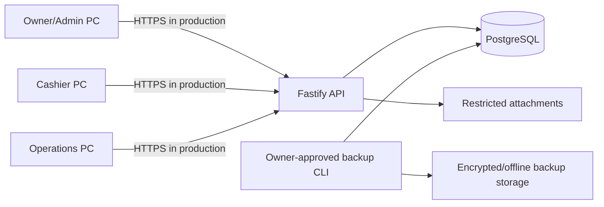

# BCIS technical documentation

## System purpose and boundaries

BCIS is a Windows desktop subscription billing and collection system for three office workstations. Electron clients communicate with one Fastify API over the LAN. Only the API can access PostgreSQL. The renderer has no Node.js, filesystem, database, process, or unrestricted network capability.

The implemented server domain covers authentication/RBAC, subscribers and multiple services, monthly billing, immutable invoices, ledger posting, Cash/GCash payments, oldest-first allocations, credits, receipts, reversals, collectors, route snapshots, remittance reconciliation, aging, dashboards, reports, and service history. Desktop screens currently expose authentication, dashboard, subscribers/profile, service history, reports, exports, and connection diagnostics. Billing, payment, GCash, collection, reversal, user administration, and backup operations are API/test/CLI workflows without finished desktop screens.

## Runtime architecture

The monorepo contains `apps/desktop`, `apps/api`, and `packages/shared`. Shared Zod contracts define HTTP/IPC values. Authoritative money crosses JSON as canonical integer-centavo strings and is stored as PostgreSQL `bigint`.

## Modules

| Module | Responsibilities |
| --- | --- |
| Authentication | Salted scrypt passwords, hashed bearer sessions, lockout, password rotation and logout |
| RBAC | Database-backed roles and granular permission checks on every business route |
| Subscribers | Identity, contacts, addresses, service accounts, plans, areas and collectors |
| Billing | Calendar-month cycles, invoice snapshots, unique invoice numbers and ledger debits |
| Payments | Posting, GCash review, allocation, credits, receipts, reversal and compensating ledger entries |
| Collections | Route-sheet snapshots, recorded collections, remittance, variance and authorized close |
| Receivables | Outstanding balances, overdue filters and exact AR aging buckets |
| Reports | Dashboard queries, six tabular reports, audited PDF/XLSX export and print views |
| System | Backup history visibility plus guarded backup/restore verification CLI |

## Financial invariants

- All authoritative amounts are integer centavos; no floating-point posting occurs.
- Invoice `(service_account_id, billing_cycle_id)` and invoice/receipt numbers are database-unique.
- Finalized invoice totals and line items cannot be updated or deleted.
- Payment posting locks each subscriber, locks open invoices, and allocates oldest due invoice first.
- Allocations plus unapplied credit equal the posted payment amount.
- GCash stays pending until an authorized verifier acts; references are normalized and unique case-insensitively.
- Reversal retains the original payment, adds a linked reversal, voids the receipt, restores balances, and posts a compensating ledger debit.
- Remittance difference is always `remitted cash - expected cash`; closing a variance requires an acknowledgement.
- Financial writes and their audit records use the same PostgreSQL transaction.

## Database and concurrency

Drizzle migrations under `apps/api/drizzle` create normalized tables, foreign keys, named checks, unique indexes, sequences, and immutability triggers. Subscriber advisory locks serialize competing payment allocations. Idempotency-key locks make retried requests return the original payment. Database sequences produce invoice, receipt, and batch numbers without `MAX + 1` races.

AT-09 automated coverage creates three active API sessions. Two Cashier sessions post separate payments concurrently while a Viewer calls the same endpoint and receives HTTP 403. Tests prove two distinct payment IDs, two unique receipt numbers, two stored payments, and no unauthorized mutation. Physical three-PC LAN testing remains a deployment-site check.

## API and desktop boundary

Public routes are limited to health/readiness and login. Protected routes authenticate a bearer token and require explicit permissions. Relevant route groups are `/subscribers`, `/billing`, `/payments`, `/collection-batches`, `/receivables`, `/dashboard`, `/reports`, `/admin`, and `/system/backups`.

The preload exposes only named operations: session/authentication, connection status, subscriber operations, dashboard/report queries, exports, and service history. Main-process handlers validate IPC payloads and sender origin. Report exports alone receive a user-selected filesystem path.

## Security model

- Electron: context isolation, sandbox, no Node integration, web security, blocked navigation/windows, denied permissions, restrictive CSP and sender validation.
- API: Zod validation, bounded body/timeouts, safe error codes, authorization before handlers, structured logs and credential redaction.
- Identity: salted scrypt, generic login errors, lockout after five failures, 30-minute idle and eight-hour absolute session limits.
- Audit: authorization denials and financial mutations retain actor, request, reason and relevant before/after data; database triggers block audit changes/deletes.
- Attachments: proof metadata validates MIME type, size, SHA-256 and safe storage key. Durable restricted binary attachment storage is not implemented.
- Transport: HTTP is development-only. Production LAN deployment requires HTTPS termination and a trusted certificate.

`npm audit --omit=dev` reported zero shipped production dependency vulnerabilities on 2026-10-10. The complete development tree reported 12 moderate findings in build/migration tooling; no high or critical findings remained after updating electron-builder to 26.15.3. The generated installer is not Authenticode-signed.

## Backup and restore

Run `npm run verify:restore` only against the disposable `TEST_DATABASE_URL`. The verifier requires `owner.demo` to have the active OWNER role, creates a custom-format `pg_dump`, computes SHA-256, records `backup_history`, inserts a post-backup mutation, restores into an isolated database, runs `pg_amcheck`, compares record counts and foreign keys, proves the mutation is absent, records RESTORED, writes JSON evidence, and deletes the temporary restore database. Production restore requires a maintenance window, separate encrypted backup storage, an Owner approval record, and a rehearsal before use.

## Known limits

- No completed desktop screens for billing generation, receive-payment, GCash queue, collection reconciliation, reversals, user administration, or backup/restore.
- Three physical Windows clients and production HTTPS/firewall configuration are not laboratory-tested here.
- Installer is unsigned; Windows may show an unknown-publisher warning.
- Performance at the required maximum dataset has not been load-tested with 500,000 invoices/payments.
- Restricted proof-image binary storage and attachment backup are not implemented.
